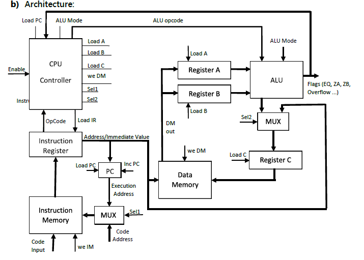
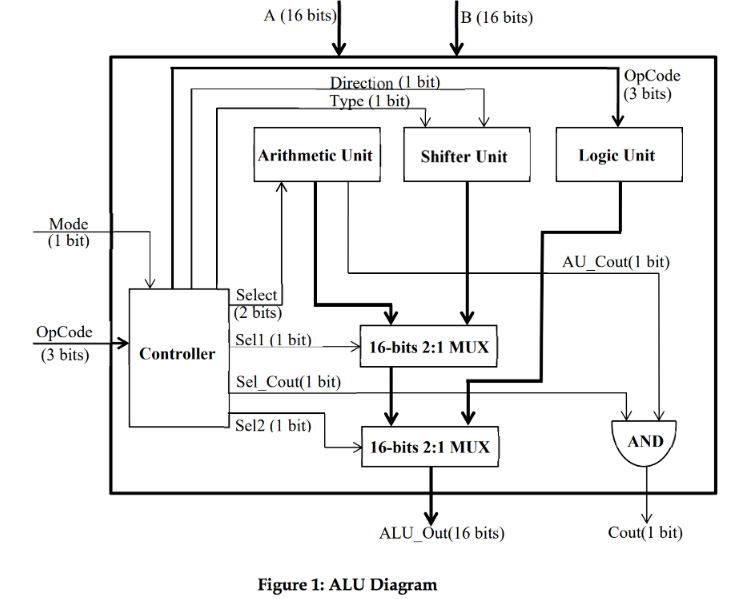

**_16-Bit CPU Design in Verilog HDL_**

.PNG)

**Components used**:
1) ALU-Arithmetic Unit, Logical Unit, Shifter
2) Data Memory
3) Program Counter
4) Instruction memory
5) Instruction Register
6) Multiplexers
7) Controller
